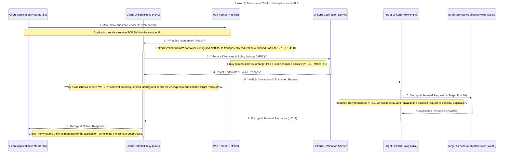

# Linkerd: Quick Start

## Refs

- https://linkerd.io/2.19/getting-started/

## Quick Start

```bash
kind create cluster
```

```bash
$ export LINKERD2_VERSION=edge-25.10.7 && curl --proto '=https' --tlsv1.2 -sSfL https://run.linkerd.io/install-edge | sh
$ export PATH=$HOME/.linkerd2/bin:$PATH >> ~/.zshrc
$ linkerd version

Client version: edge-25.10.7
Server version: unavailable
```

```bash
$ kubectl apply -f https://github.com/kubernetes-sigs/gateway-api/releases/download/v1.4.0/standard-install.yaml
$ linkerd check --pre

kubernetes-api
--------------
√ can initialize the client
√ can query the Kubernetes API

kubernetes-version
------------------
√ is running the minimum Kubernetes API version

pre-kubernetes-setup
--------------------
√ control plane namespace does not already exist
√ can create non-namespaced resources
√ can create ServiceAccounts
√ can create Services
√ can create Deployments
√ can create CronJobs
√ can create ConfigMaps
√ can create Secrets
√ can read Secrets
√ can read extension-apiserver-authentication configmap
√ no clock skew detected

linkerd-version
---------------
√ can determine the latest version
‼ cli is up-to-date
    is running version 25.10.7 but the latest edge version is 25.12.2
    see https://linkerd.io/2/checks/#l5d-version-cli for hints

Status check results are √
```

```bash
$ linkerd install --crds | kubectl apply -f -
...
$ linkerd install | kubectl apply -f -
...
$ linkerd check

kubernetes-api
--------------
√ can initialize the client
√ can query the Kubernetes API

kubernetes-version
------------------
√ is running the minimum Kubernetes API version

linkerd-existence
-----------------
√ 'linkerd-config' config map exists
√ heartbeat ServiceAccount exist
√ control plane replica sets are ready
√ no unschedulable pods
√ control plane pods are ready
√ cluster networks contains all node podCIDRs
√ cluster networks contains all pods
√ cluster networks contains all services

linkerd-config
--------------
√ control plane Namespace exists
√ control plane ClusterRoles exist
√ control plane ClusterRoleBindings exist
√ control plane ServiceAccounts exist
√ control plane CustomResourceDefinitions exist
√ control plane MutatingWebhookConfigurations exist
√ control plane ValidatingWebhookConfigurations exist
√ proxy-init container runs as root user if docker container runtime is used

linkerd-identity
----------------
√ certificate config is valid
√ trust anchors are using supported crypto algorithm
√ trust anchors are within their validity period
√ trust anchors are valid for at least 60 days
√ issuer cert is using supported crypto algorithm
√ issuer cert is within its validity period
√ issuer cert is valid for at least 60 days
√ issuer cert is issued by the trust anchor

linkerd-webhooks-and-apisvc-tls
-------------------------------
√ proxy-injector webhook has valid cert
√ proxy-injector cert is valid for at least 60 days
√ sp-validator webhook has valid cert
√ sp-validator cert is valid for at least 60 days
√ policy-validator webhook has valid cert
√ policy-validator cert is valid for at least 60 days

linkerd-version
---------------
√ can determine the latest version
‼ cli is up-to-date
    is running version 25.10.7 but the latest edge version is 25.12.2
    see https://linkerd.io/2/checks/#l5d-version-cli for hints

control-plane-version
---------------------
√ can retrieve the control plane version
‼ control plane is up-to-date
    is running version 25.10.7 but the latest edge version is 25.12.2
    see https://linkerd.io/2/checks/#l5d-version-control for hints
√ control plane and cli versions match

linkerd-control-plane-proxy
---------------------------
√ control plane proxies are healthy
‼ control plane proxies are up-to-date
    some proxies are not running the current version:
	* linkerd-destination-745b77596c-x2q9l (edge-25.10.7)
	* linkerd-identity-59dc7985cb-7lvmv (edge-25.10.7)
	* linkerd-proxy-injector-8677f8969-9nm44 (edge-25.10.7)
    see https://linkerd.io/2/checks/#l5d-cp-proxy-version for hints
√ control plane proxies and cli versions match

linkerd-extension-checks
------------------------
√ namespace configuration for extensions

Status check results are √
```

```bash
$ curl --proto '=https' --tlsv1.2 -sSfL https://run.linkerd.io/emojivoto.yml \
  | kubectl apply -f -
...
$ kubectl -n emojivoto port-forward svc/web-svc 8080:80

Forwarding from 127.0.0.1:8080 -> 8080
Forwarding from [::1]:8080 -> 8080
Handling connection for 8080
```

```bash
$ kubectl get -n emojivoto deploy -o yaml \
  | linkerd inject - \
  | kubectl apply -f -
...
❯ linkerd -n emojivoto check --proxy

kubernetes-api
--------------
√ can initialize the client
√ can query the Kubernetes API

kubernetes-version
------------------
√ is running the minimum Kubernetes API version

linkerd-existence
-----------------
√ 'linkerd-config' config map exists
√ heartbeat ServiceAccount exist
√ control plane replica sets are ready
√ no unschedulable pods
√ control plane pods are ready
√ cluster networks contains all node podCIDRs
√ cluster networks contains all pods
√ cluster networks contains all services

linkerd-config
--------------
√ control plane Namespace exists
√ control plane ClusterRoles exist
√ control plane ClusterRoleBindings exist
√ control plane ServiceAccounts exist
√ control plane CustomResourceDefinitions exist
√ control plane MutatingWebhookConfigurations exist
√ control plane ValidatingWebhookConfigurations exist
√ proxy-init container runs as root user if docker container runtime is used

linkerd-identity
----------------
√ certificate config is valid
√ trust anchors are using supported crypto algorithm
√ trust anchors are within their validity period
√ trust anchors are valid for at least 60 days
√ issuer cert is using supported crypto algorithm
√ issuer cert is within its validity period
√ issuer cert is valid for at least 60 days
√ issuer cert is issued by the trust anchor

linkerd-webhooks-and-apisvc-tls
-------------------------------
√ proxy-injector webhook has valid cert
√ proxy-injector cert is valid for at least 60 days
√ sp-validator webhook has valid cert
√ sp-validator cert is valid for at least 60 days
√ policy-validator webhook has valid cert
√ policy-validator cert is valid for at least 60 days

linkerd-identity-data-plane
---------------------------
√ data plane proxies certificate match CA

linkerd-version
---------------
√ can determine the latest version
‼ cli is up-to-date
    is running version 25.10.7 but the latest edge version is 25.12.2
    see https://linkerd.io/2/checks/#l5d-version-cli for hints

linkerd-control-plane-proxy
---------------------------
√ control plane proxies are healthy
‼ control plane proxies are up-to-date
    some proxies are not running the current version:
	* linkerd-destination-745b77596c-x2q9l (edge-25.10.7)
	* linkerd-identity-59dc7985cb-7lvmv (edge-25.10.7)
	* linkerd-proxy-injector-8677f8969-9nm44 (edge-25.10.7)
    see https://linkerd.io/2/checks/#l5d-cp-proxy-version for hints
√ control plane proxies and cli versions match

linkerd-data-plane
------------------
√ data plane namespace exists
√ data plane proxies are ready
‼ data plane is up-to-date
    some proxies are not running the current version:
	* emoji-78668bb774-8hcb8 (edge-25.10.7)
	* vote-bot-7b7b6c499f-zz2cr (edge-25.10.7)
	* voting-74494fc947-czrr7 (edge-25.10.7)
	* web-76cd6968c5-5kpnt (edge-25.10.7)
    see https://linkerd.io/2/checks/#l5d-data-plane-version for hints
√ data plane and cli versions match
√ data plane pod labels are configured correctly
√ data plane service labels are configured correctly
√ data plane service annotations are configured correctly
I1214 21:30:43.824041   75139 warnings.go:110] "Warning: v1 Endpoints is deprecated in v1.33+; use discovery.k8s.io/v1 EndpointSlice"
I1214 21:30:43.827310   75139 warnings.go:110] "Warning: v1 Endpoints is deprecated in v1.33+; use discovery.k8s.io/v1 EndpointSlice"
√ opaque ports are properly annotated

Status check results are √
```

```bash
$ linkerd viz install | kubectl apply -f -
...
$ linkerd check

kubernetes-api
--------------
√ can initialize the client
√ can query the Kubernetes API

kubernetes-version
------------------
√ is running the minimum Kubernetes API version

linkerd-existence
-----------------
√ 'linkerd-config' config map exists
√ heartbeat ServiceAccount exist
√ control plane replica sets are ready
√ no unschedulable pods
√ control plane pods are ready
√ cluster networks contains all node podCIDRs
√ cluster networks contains all pods
√ cluster networks contains all services

linkerd-config
--------------
√ control plane Namespace exists
√ control plane ClusterRoles exist
√ control plane ClusterRoleBindings exist
√ control plane ServiceAccounts exist
√ control plane CustomResourceDefinitions exist
√ control plane MutatingWebhookConfigurations exist
√ control plane ValidatingWebhookConfigurations exist
√ proxy-init container runs as root user if docker container runtime is used

linkerd-identity
----------------
√ certificate config is valid
√ trust anchors are using supported crypto algorithm
√ trust anchors are within their validity period
√ trust anchors are valid for at least 60 days
√ issuer cert is using supported crypto algorithm
√ issuer cert is within its validity period
√ issuer cert is valid for at least 60 days
√ issuer cert is issued by the trust anchor

linkerd-webhooks-and-apisvc-tls
-------------------------------
√ proxy-injector webhook has valid cert
√ proxy-injector cert is valid for at least 60 days
√ sp-validator webhook has valid cert
√ sp-validator cert is valid for at least 60 days
√ policy-validator webhook has valid cert
√ policy-validator cert is valid for at least 60 days

linkerd-version
---------------
√ can determine the latest version
‼ cli is up-to-date
    is running version 25.10.7 but the latest edge version is 25.12.2
    see https://linkerd.io/2/checks/#l5d-version-cli for hints

control-plane-version
---------------------
√ can retrieve the control plane version
‼ control plane is up-to-date
    is running version 25.10.7 but the latest edge version is 25.12.2
    see https://linkerd.io/2/checks/#l5d-version-control for hints
√ control plane and cli versions match

linkerd-control-plane-proxy
---------------------------
√ control plane proxies are healthy
‼ control plane proxies are up-to-date
    some proxies are not running the current version:
	* linkerd-destination-745b77596c-x2q9l (edge-25.10.7)
	* linkerd-identity-59dc7985cb-7lvmv (edge-25.10.7)
	* linkerd-proxy-injector-8677f8969-9nm44 (edge-25.10.7)
    see https://linkerd.io/2/checks/#l5d-cp-proxy-version for hints
√ control plane proxies and cli versions match

linkerd-extension-checks
------------------------
√ namespace configuration for extensions

linkerd-viz
-----------
√ linkerd-viz Namespace exists
√ can initialize the client
√ linkerd-viz ClusterRoles exist
√ linkerd-viz ClusterRoleBindings exist
√ tap API server has valid cert
√ tap API server cert is valid for at least 60 days
√ tap API service is running
√ linkerd-viz pods are injected
√ viz extension pods are running
√ viz extension proxies are healthy
‼ viz extension proxies are up-to-date
    some proxies are not running the current version:
	* metrics-api-79fcb75f75-w7fg5 (edge-25.10.7)
	* prometheus-7bb7f55b49-t9lpm (edge-25.10.7)
	* tap-58559d64bb-l62rn (edge-25.10.7)
	* tap-injector-6b5db799d4-sp5mp (edge-25.10.7)
	* web-cc4454b95-q2jhz (edge-25.10.7)
    see https://linkerd.io/2/checks/#l5d-viz-proxy-cp-version for hints
√ viz extension proxies and cli versions match
√ prometheus is installed and configured correctly
√ viz extension self-check

Status check results are √
```

```bash
$ linkerd viz dashboard &
```

## Sequence

The sequence diagram below details the operational mechanics of Linkerd, focusing on how it intercepts and manages inter-service communication within a Kubernetes cluster.

###  Core Concept: Transparent Proxying

Linkerd operates as a **transparent sidecar proxy**. This means the application code does not need to know that Linkerd exists; the proxy handles networking, security, and observability automatically by hijacking network traffic at the kernel level.

### Detailed Sequence Diagram: Outbound Request in Linkerd

This diagram illustrates the journey of an outbound request originating from the `vote-bot` application targeting an upstream service (e.g., `web-svc`), emphasizing the technical points of interception and security.



### Key Takeaways

| Aspect | Linkerd's Role | Technical Detail |
| --- | --- | --- |
| **Traffic Interception** | **Transparency** | The **Linkerd Init Container** runs first, setting up `iptables` rules that redirect (hijack) incoming and outgoing traffic to the Sidecar Proxy ports (`4140` Outbound, `4143` Inbound). |
| **Security** | **Automatic mTLS** | The proxies handle **Mutual TLS** (mTLS) between services automatically. Communication is encrypted/decrypted at the proxies (`5.` and `8.`), ensuring all service-to-service traffic is secure without code changes. |
| **Service Discovery** | **Routing and Policy** | The **Destination Service** (`Dst`) acts as a centralized brain, telling the proxies *which* Pod IP to connect to and *how* to handle the traffic (e.g., load balancing, policy check). |
| **Observability** | **Metric Injection** | Since all traffic passes through the proxies, Linkerd automatically injects golden metrics (latency, success rate, traffic volume) for every request, which are scraped for monitoring. |
