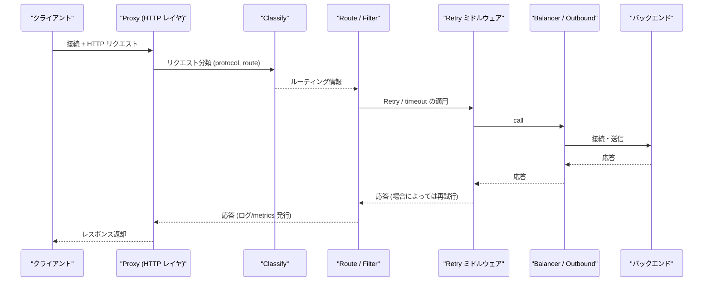
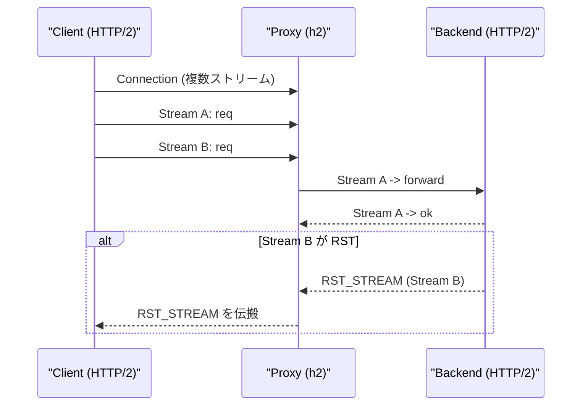

# linkerd2-proxy: Details of the HTTP Layer (`linkerd/http/*`)

- [linkerd2-proxy: Details of the HTTP Layer (`linkerd/http/*`)](#linkerd2-proxy-details-of-the-http-layer-linkerdhttp)
  - [Overview](#overview)
  - [Module List and Roles](#module-list-and-roles)
  - [Representative Processing Sequence (Request Handling)](#representative-processing-sequence-request-handling)
  - [HTTP/2 and Streaming (Important Notes)](#http2-and-streaming-important-notes)
  - [Retry and Body Buffering](#retry-and-body-buffering)
  - [Filters and Routes (Example)](#filters-and-routes-example)
  - [Access Logs and Metrics](#access-logs-and-metrics)
  - [Implementation Reference List (Key Sections)](#implementation-reference-list-key-sections)

## Overview

Linkerd の HTTP レイヤは小さな再利用可能な crate 群で構成され、各レイヤは Tower スタックとして重ねられます。主な責務は次の通りです。

- HTTP/1.x と HTTP/2 の接続・ストリーム管理（`linkerd/http/h2`, `linkerd/http/upgrade`）
- リクエストの分類とルーティング（`linkerd/http/classify`, `linkerd/http/route`）
- リトライ / バックオフ（`linkerd/http/retry`）
- ストリームタイムアウトやボディ終端の処理（`linkerd/http/stream-timeouts`, `linkerd/http/body-eos`）
- アクセスログとプロメテウスメトリクス（`linkerd/http/access-log`, `linkerd/http/metrics`, `linkerd/http/prom`）

## Module List and Roles

- `linkerd/http/h2` — HTTP/2 レイヤ、ストリーム管理やウィンドウ処理。
  - 参照: https://github.com/linkerd/linkerd2-proxy/blob/main/linkerd/http/h2/src/lib.rs

- `linkerd/http/upgrade` — HTTP/1.1 から HTTP/2 へのアップグレードなどを扱う。
  - 参照: https://github.com/linkerd/linkerd2-proxy/blob/main/linkerd/http/upgrade/src/lib.rs

- `linkerd/http/classify` — リクエストをプロトコル/ルートごとに分類し、適切な処理パスに振り分ける。
  - 参照: https://github.com/linkerd/linkerd2-proxy/blob/main/linkerd/http/classify/src/lib.rs

- `linkerd/http/route` — ルーティングルール（ヘッダ／パス／クエリ等）とフィルタ群。
  - 参照: https://github.com/linkerd/linkerd2-proxy/blob/main/linkerd/http/route/src/lib.rs

- `linkerd/http/retry` — Retry ミドルウェア（Retry Policy、ExponentialBackoff、Buffered Body）
  - 実際の再試行処理: `send_req_with_retries()`
  - 参照: https://github.com/linkerd/linkerd2-proxy/blob/main/linkerd/http/retry/src/lib.rs

- `linkerd/http/access-log` — アクセスログの生成・フォーマッタ。
  - 参照: https://github.com/linkerd/linkerd2-proxy/blob/main/linkerd/http/access-log/src/lib.rs

- `linkerd/http/metrics`, `linkerd/http/prom` — HTTP 関連メトリクスの収集（リクエスト数、リトライ数、ストリームエラーなど）。
  - 参照: https://github.com/linkerd/linkerd2-proxy/tree/main/linkerd/http/metrics

---

## Representative Processing Sequence (Request Handling)

## HTTP/2 and Streaming (Important Notes)

- HTTP/2 は単一 TCP 上で複数のストリームを扱うため、**ストリーム単位のエラー処理**（RST_STREAM の伝搬、ストリーム単位のタイムアウト）が重要です。実装は `linkerd/http/h2` と `linkerd/http/stream-timeouts` に分かれています。
- gRPC のようなストリーミングでは、**部分的な失敗**（あるストリームのみが RST）や**遅延によるバックプレッシャ**が起こり得るため、Proxy はストリームごとに状態を管理し、必要に応じてクライアントに適切なエラーを返します。

例: HTTP/2 のストリーム失敗シーケンス

参照: `linkerd/http/h2/src/lib.rs`

## Retry and Body Buffering

- Retry はリクエストボディを複製可能にするために `ReplayBody`（バッファ）を使用し、**サイズ制限**を超える場合は再試行不可になります（`max_request_bytes`）。
- ExponentialBackoff は `linkerd_exp_backoff` を利用して待機します。実装と詳細は `linkerd/http/retry/src/lib.rs` の `send_req_with_retries` を参照してください。
  - 参照: https://github.com/linkerd/linkerd2-proxy/blob/main/linkerd/http/retry/src/lib.rs#L240-L340

## Filters and Routes (Example)

- ヘッダ書換え、リダイレクト、故意注入（テスト用）などは `linkerd/http/route/src/http/filter/` に実装されています。代表的なフィルタ:
  - `modify_header.rs` — ヘッダの追加/変更
  - `redirect.rs` — リダイレクト処理
  - `inject_failure.rs` — テスト向けのエラー注入

## Access Logs and Metrics

- アクセスログは `linkerd/http/access-log` 経由で生成され、フォーマット可能です。
- メトリクスは `linkerd/http/metrics` と `linkerd/http/prom` により収集されます。重要な指標例:
  - リクエスト数 / レスポンスステータス
  - リトライ数 (`retry.requests`, `retry.limit_exceeded`)
  - ストリームエラー数 / RST 発生回数

## Implementation Reference List (Key Sections)

- `linkerd/http/h2` — HTTP/2 レイヤ
  - https://github.com/linkerd/linkerd2-proxy/blob/main/linkerd/http/h2/src/lib.rs
- `linkerd/http/retry` — Retry 実装
  - https://github.com/linkerd/linkerd2-proxy/blob/main/linkerd/http/retry/src/lib.rs
- `linkerd/http/classify` — リクエスト分類
  - https://github.com/linkerd/linkerd2-proxy/blob/main/linkerd/http/classify/src/lib.rs
- `linkerd/http/route` — ルーティング / フィルタ
  - https://github.com/linkerd/linkerd2-proxy/blob/main/linkerd/http/route/src/lib.rs
- `linkerd/http/access-log` — アクセスログ
  - https://github.com/linkerd/linkerd2-proxy/blob/main/linkerd/http/access-log/src/lib.rs
- `linkerd/http/metrics` / `linkerd/http/prom` — メトリクス
  - https://github.com/linkerd/linkerd2-proxy/tree/main/linkerd/http/metrics
