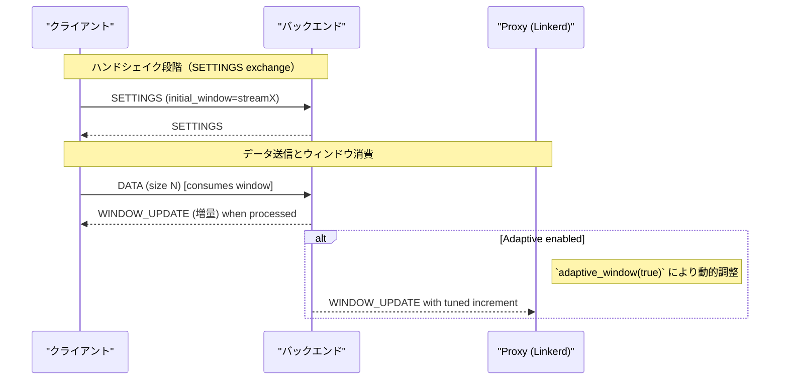

# HTTP/2 Window Management Details (`http/h2-window.md`)

- [HTTP/2 Window Management Details (`http/h2-window.md`)](#http2-window-management-details-httph2-windowmd)
  - [Overview](#overview)
  - [Implementation and Environment Variables (Reference)](#implementation-and-environment-variables-reference)
  - [Behavior (Conceptual Sequence Diagram)](#behavior-conceptual-sequence-diagram)
  - [Tuning Policy (Practical Perspective)](#tuning-policy-practical-perspective)
  - [Benchmark / Verification Procedure (Execution Plan)](#benchmark--verification-procedure-execution-plan)
  - [Metrics to Collect (Prometheus Integration)](#metrics-to-collect-prometheus-integration)

## Overview

HTTP/2 のフロー制御は、**ストリーム単位のウィンドウ**と**コネクション全体のウィンドウ**により、送信者が送れるデータ量を制御します。Linkerd ではこれらを初期値（`initial_stream_window_size`, `initial_connection_window_size`）で設定可能で、`Adaptive` モードでは `hyper` がランタイムでウィンドウを調整します。

主な設定/ポイント:

- `initial_stream_window_size`（ストリームごとの初期ウィンドウ）
- `initial_connection_window_size`（コネクション全体の初期ウィンドウ）
- `Adaptive` フロー制御（`builder.adaptive_window(true)`）
- Keep-Alive / PING による接続維持

## Implementation and Environment Variables (Reference)

- デフォルト値（ソース）:
  - `DEFAULT_INITIAL_STREAM_WINDOW_SIZE = 65535`（Linkerd のデフォルト）
  - `DEFAULT_INITIAL_CONNECTION_WINDOW_SIZE = 1048576`（1MB）
  - 定義箇所: `linkerd/app/src/env.rs`（`DEFAULT_INITIAL_STREAM_WINDOW_SIZE`、`DEFAULT_INITIAL_CONNECTION_WINDOW_SIZE`）

- 環境変数（設定）:
  - `LINKERD2_PROXY_HTTP2_INITIAL_STREAM_WINDOW_SIZE`
  - `LINKERD2_PROXY_HTTP2_INITIAL_CONNECTION_WINDOW_SIZE`
  - Adaptive 有効化: `LINKERD2_PROXY_HTTP2_ADAPTIVE_FLOW_CONTROL=true`（`linkerd/app/src/env/http2.rs` でパース）

- プロキシ適用箇所: `linkerd/proxy/http/src/h2.rs` の `Builder` 設定（`adaptive_window`, `initial_*_window_size`）

## Behavior (Conceptual Sequence Diagram)



## Tuning Policy (Practical Perspective)

- 小さい `initial_stream_window_size` は多数の並列ストリームでスループットが下がる可能性がある。
- 大きすぎる `initial_connection_window_size` はメモリ消費を引き上げる（特に多数の並列ストリームで危険）。
- `Adaptive` は RTT / 帯域変動が大きい環境で有効だが、安定したネットワークでは固定ウィンドウの方が予測しやすい。
- 長時間ストリーミング（gRPC streaming）では、`initial_stream_window_size` を増やすとオーバーヘッドが下がりスループットが上がるが、メモリトレードオフを考慮する。

## Benchmark / Verification Procedure (Execution Plan)

目的: ウィンドウ設定・Adaptive の有無・並列ストリーム数が性能に与える影響を定量化する。

1. 準備
   - シナリオ: (A) small RPC (短いレスポンス), (B) large streaming (継続的なデータ)
   - ツール: `ghz` (gRPC), `wrk2` (HTTP/1.1 に近い), カスタム `tokio+hyper` ベンチ
   - 環境変数で Proxy に設定を注入:

     ```bash
     export LINKERD2_PROXY_HTTP2_INITIAL_STREAM_WINDOW_SIZE=65536
     export LINKERD2_PROXY_HTTP2_INITIAL_CONNECTION_WINDOW_SIZE=1048576
     export LINKERD2_PROXY_HTTP2_ADAPTIVE_FLOW_CONTROL=false
     ```

2. パラメータ行列
   - `initial_stream_window_size`: 64KB, 256KB, 1MB
   - `initial_connection_window_size`: 1MB, 4MB, 16MB
   - Adaptive: on / off
   - 並列ストリーム: 1, 8, 64, 256
3. 測定項目
   - RPS / throughput
   - P50/P95/P99 レイテンシ
   - ストリーム切断（RST）率
   - CPU / メモリ使用率
4. 実行例（ghz, gRPC）
   - サーバと Proxy を立てて、`ghz` を次のように実行:

     ```bash
     ghz --insecure --proto service.proto --call pkg.Service.Method -n 100000 --concurrency 64 --rps 10000 --data '{"size":1024}' <SERVER_ADDR>
     ```

5. 結果の取りまとめ
   - 各実験ごとに P50/P95/P99 を記録し、ウィンドウサイズ／Adaptive の組合せで比較グラフを作成

## Metrics to Collect (Prometheus Integration)

- `http_h2_streams_active`（ストリーム数）
- `http_h2_rst_count`（RST 発生回数）
- CPU / メモリ / ネットワーク利用率
- Proxy ごとの接続数 / バックプレッシャの発生（application-level metrics）

---

参照:
- `linkerd/app/src/env.rs`（デフォルトウィンドウ定義）
- `linkerd/app/src/env/http2.rs`（env パーサ）
- `linkerd/proxy/http/src/h2.rs`（Builder による適用）
- `linkerd/http/h2/src/lib.rs`（`FlowControl` 型）
