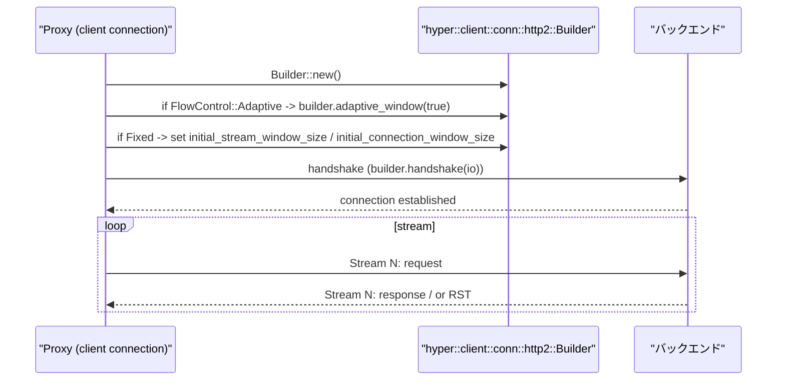

# linkerd2-proxy: HTTP/2 Deep Dive (`linkerd/http/h2` and Proxy Handling)

- [linkerd2-proxy: HTTP/2 Deep Dive (`linkerd/http/h2` and Proxy Handling)](#linkerd2-proxy-http2-deep-dive-linkerdhttph2-and-proxy-handling)
  - [Overview](#overview)
  - [Implementation Reference (Key Sections)](#implementation-reference-key-sections)
  - [From the Perspective of Behavior (Operation/Design)](#from-the-perspective-of-behavior-operationdesign)
  - [Representative Sequence (Connection Establishment and Configuration Application)](#representative-sequence-connection-establishment-and-configuration-application)
  - [Bench Plan (Proposal)](#bench-plan-proposal)
  - [List of Reference Implementations](#list-of-reference-implementations)

## Overview

Linkerd は `linkerd/http/h2`（パラメータ定義）と `linkerd/proxy/http/src/h2.rs`（接続ビルド）を通じて HTTP/2 の挙動を制御します。主な設定項目:

- FlowControl: `Adaptive` または `Fixed { initial_stream_window_size, initial_connection_window_size }`
- KeepAlive（PING）: タイムアウト / 間隔 / while_idle
- max_frame_size / max_send_buf_size / max_concurrent_reset_streams

## Implementation Reference (Key Sections)

- FlowControl 型: `linkerd/http/h2/src/lib.rs` — `FlowControl::Adaptive | Fixed` を定義
  - https://github.com/linkerd/linkerd2-proxy/blob/main/linkerd/http/h2/src/lib.rs

- 環境変数とデフォルト値設定: `linkerd/app/src/env/http2.rs` と `linkerd/app/src/env.rs`
  - Env のパーサ: https://github.com/linkerd/linkerd2-proxy/blob/main/linkerd/app/src/env/http2.rs
  - デフォルト値（protocol defaults）: `DEFAULT_INITIAL_STREAM_WINDOW_SIZE = 65535` と `DEFAULT_INITIAL_CONNECTION_WINDOW_SIZE = 1048576`（`linkerd/app/src/env.rs`）
    - https://github.com/linkerd/linkerd2-proxy/blob/main/linkerd/app/src/env.rs#L304-L312

- プロキシ接続時の適用箇所（Builder 設定）: `linkerd/proxy/http/src/h2.rs`
  - `builder.adaptive_window(true)`（Adaptive フロー制御）
  - `builder.initial_stream_window_size(...)`, `initial_connection_window_size(...)`（Fixed）
  - 参照: https://github.com/linkerd/linkerd2-proxy/blob/main/linkerd/proxy/http/src/h2.rs#L86-L106

## From the Perspective of Behavior (Operation/Design)

- **ウィンドウサイズ**:
  - Stream と Connection の初期ウィンドウは流量とパフォーマンスに直接影響します。
  - デフォルト値はプロトコルの既定値（stream=65535, conn=1MB）ですが、長時間のストリーミングや高並列ストリーム時は調整の余地があります。

- **Adaptive Flow Control**:
  - 有効にすると `hyper` の adaptive window 機能を利用して動的にウィンドウを調整します（`builder.adaptive_window(true)`）。
  - 高変動な RTT / 帯域環境では adaptive が有利な場合がありますが、実環境での検証が必要です。

- **RST とストリーム切断**:
  - 個別ストリームで RST が発生した場合は、そのストリームのみを閉じ、他ストリームは継続可能。
  - Proxy は RST をクライアントに伝搬します（`linkerd/http/h2` と上位レイヤでの伝搬処理）。

## Representative Sequence (Connection Establishment and Configuration Application)

## Bench Plan (Proposal)

目的: ウィンドウサイズ・Adaptive の有無・並列ストリーム数 が gRPC / HTTP/2 スループットと P99 レイテンシに与える影響を測定。

1. ベンチ種類
   - マイクロベンチ（`hyper` レイヤでの小さなリクエスト/レスポンス）
   - 実トラフィックに近い gRPC ストリーミング（`ghz`）や `wrk2` で長時間ストリーム
2. パラメータ
   - initial_stream_window_size: 64KB / 256KB / 1MB
   - initial_connection_window_size: 1MB / 4MB / 16MB
   - Adaptive: on / off
   - 並列ストリーム数: 1 / 8 / 64 / 256
3. 測定項目
   - スループット (RPS)
   - P50/P95/P99 レイテンシ
   - ストリームごとのエラー率（RST 等）
   - CPU/メモリ使用率
4. 実行例
   - gRPC: `ghz --insecure --concurrency 64 --rps 10000 --data ...`（外部ツールと組合せ）
   - カスタムベンチ: `tokio` + `hyper` を使う統合ベンチ（`criterion` も可）

## List of Reference Implementations

- `linkerd/http/h2` — FlowControl, Params の定義
  - https://github.com/linkerd/linkerd2-proxy/blob/main/linkerd/http/h2/src/lib.rs
- `linkerd/app/src/env/http2.rs` — 環境変数パーサ（`ADAPTIVE_FLOW_CONTROL`, `INITIAL_*_WINDOW_SIZE`）
  - https://github.com/linkerd/linkerd2-proxy/blob/main/linkerd/app/src/env/http2.rs
- `linkerd/proxy/http/src/h2.rs` — `Builder` による設定反映（adaptive_window / initial_*）
  - https://github.com/linkerd/linkerd2-proxy/blob/main/linkerd/proxy/http/src/h2.rs#L86-L106
