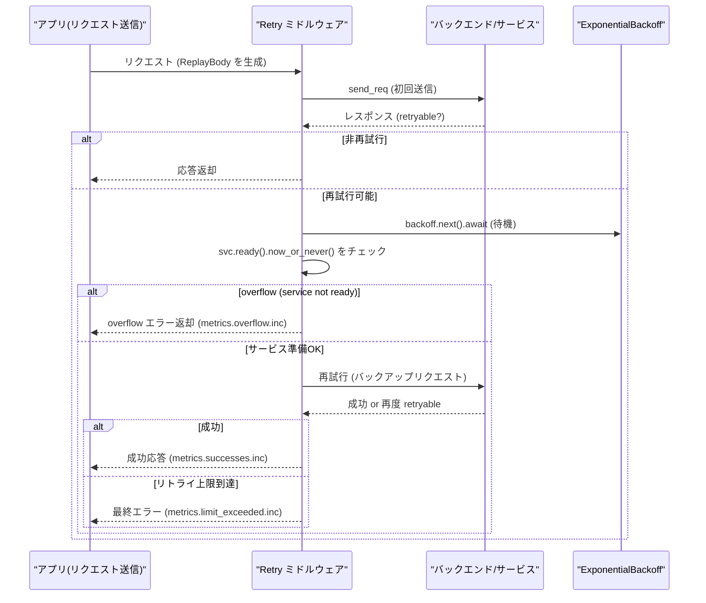

# Retry (`linkerd/http/retry`) Details

- [Retry (`linkerd/http/retry`) Details](#retry-linkerdhttpretry-details)
  - [Overview](#overview)
  - [Representative Sequence (Details of `send_req_with_retries`)](#representative-sequence-details-of-send_req_with_retries)
  - [Key Implementation Points (Code Reference)](#key-implementation-points-code-reference)
  - [Metrics and Operational Perspectives](#metrics-and-operational-perspectives)
  - [Improvement Proposals / Additional Tasks](#improvement-proposals--additional-tasks)

## Overview

`linkerd/http/retry` は、Policy に基づいて再試行を行うミドルウェアです。主な要素:

- **Policy**: 再試行の判定（`is_retryable`）やヘッダ/拡張のセットを行うトレイト
- **Params**: `max_retries`, `max_request_bytes`, `backoff`（指数バックオフ）
- **ReplayBody**: リクエストボディを複製可能にするバッファ。一定サイズを超えれば再試行は不可
- **Metrics**: `requests`, `successes`, `limit_exceeded`, `overflow`

実装の主なファイル: `linkerd/http/retry/src/lib.rs`

## Representative Sequence (Details of `send_req_with_retries`)

## Key Implementation Points (Code Reference)

- `send_req_with_retries`（主要ループ）
  - 定義: `linkerd/http/retry/src/lib.rs` `async fn send_req_with_retries(...)`
  - 参照: https://github.com/linkerd/linkerd2-proxy/blob/main/linkerd/http/retry/src/lib.rs#L276-L360
  - 要点: 初回送信、`policy.is_retryable` の判断、`backup` の作成（`mk_backup`）、`backoff.next().await`、`svc.ready().now_or_never()` による overflow 判定、再試行回数制御

- `send_req`（送信ラッパー、レスポンスのトレイラ確認）
  - 参照: https://github.com/linkerd/linkerd2-proxy/blob/main/linkerd/http/retry/src/lib.rs#L332-L352

- `mk_backup`（バックアップリクエストの複製）
  - 参照: https://github.com/linkerd/linkerd2-proxy/blob/main/linkerd/http/retry/src/lib.rs#L352-L370

- `ReplayBody`（バッファリング）
  - バッファサイズ制限により再試行可能性が失われる点に注意（`max_request_bytes`）
  - 実装: `linkerd/http/retry/src/replay.rs`（`ReplayBody::try_new` 等）
  - 参照: https://github.com/linkerd/linkerd2-proxy/blob/main/linkerd/http/retry/src/replay.rs

## Metrics and Operational Perspectives

- 監視すべきメトリクス:
  - `retry.requests` — 再試行が発行された回数
  - `retry.successes` — 再試行後に成功した回数
  - `retry.limit_exceeded` — 再試行の上限を超えた回数
  - `retry.overflow` — サービスが非準備状態で再試行できなかった回数

- 運用のヒント:
  - 大きなリクエストボディ（ストリーミングや upload）の場合、ReplayBody の `max_request_bytes` を超えると再試行は不能。
  - Retry の設定は ServiceProfile に由来することが多く、Profile の設定変更が即座に挙動へ反映されます。

## Improvement Proposals / Additional Tasks

- **再試行シミュレーションベンチ**: 異なる `max_retries` / `backoff` / ボディサイズでの P99 レイテンシと成功率を測定するベンチを作成すると良いです。
- **Circuit-breaker の挙動のドキュメント化**: `svc.ready().now_or_never()` による落ち方（overflow を生じる条件）を運用ドキュメントへ追記。
