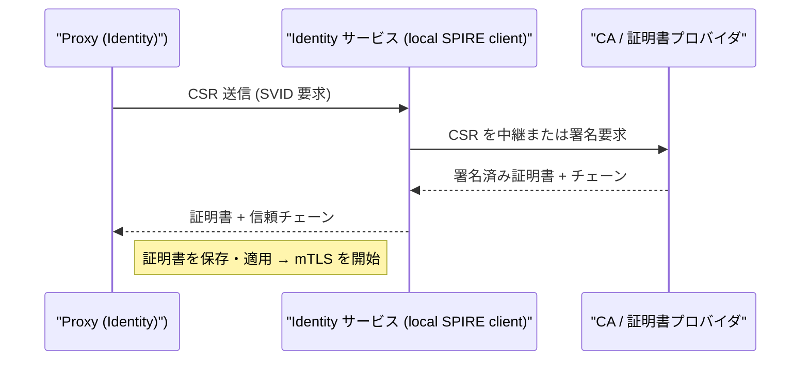
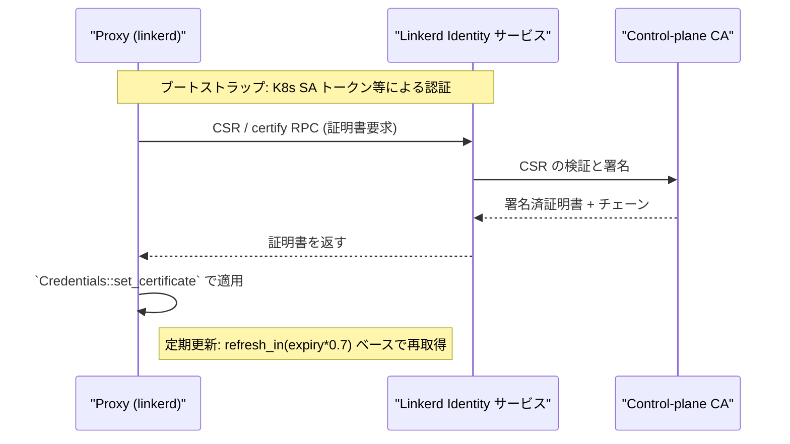
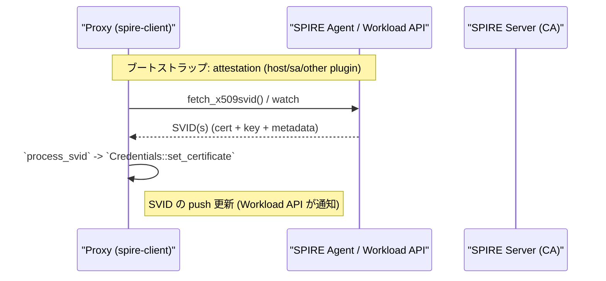
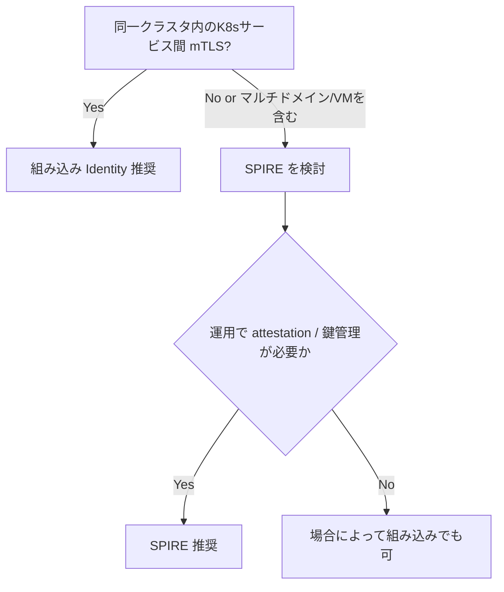
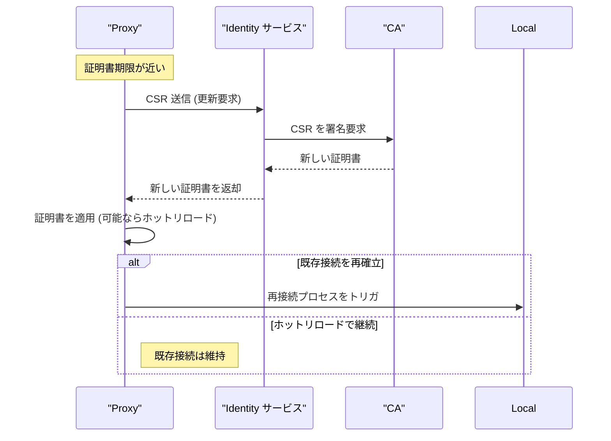
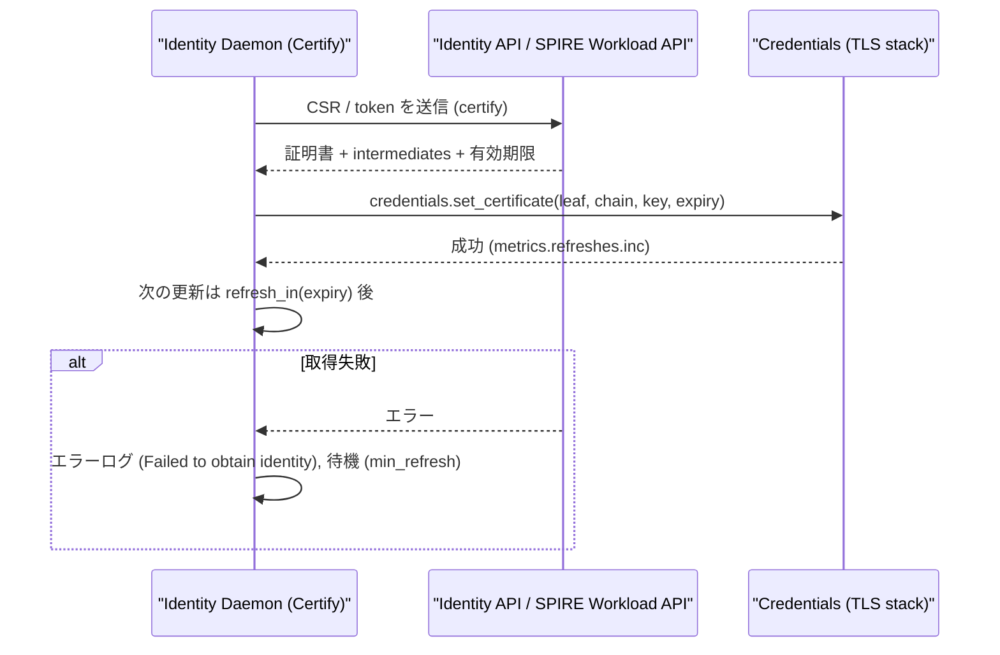

# linkerd2-proxy: Identity (Certificate / mTLS) Flow Details

- [linkerd2-proxy: Identity (Certificate / mTLS) Flow Details](#linkerd2-proxy-identity-certificate--mtls-flow-details)
  - [Overview](#overview)
  - [Representative Sequence (CSR Issuance and Certificate Acquisition)](#representative-sequence-csr-issuance-and-certificate-acquisition)
    - [Reference Code](#reference-code)
  - [Implementation Considerations](#implementation-considerations)
    - [Supplementary Notes on SPIRE and SVID](#supplementary-notes-on-spire-and-svid)
  - [FAQ — “Is SPIRE Really Necessary?”](#faq--is-spire-really-necessary)
  - [Deep Dive: Detailed Comparison of Embedded Identity and SPIRE](#deep-dive-detailed-comparison-of-embedded-identity-and-spire)
    - [1) Detailed Sequence (Difference Between Issuance and Update)](#1-detailed-sequence-difference-between-issuance-and-update)
      - [Embedded Identity (Using Linkerd Control Plane)](#embedded-identity-using-linkerd-control-plane)
      - [SPIRE (SVID Distribution Using the Workload API)](#spire-svid-distribution-using-the-workload-api)
    - [2) Functional Differences (Summarized in a Short Table)](#2-functional-differences-summarized-in-a-short-table)
    - [3) Practical Decision Flowchart (Recommended)](#3-practical-decision-flowchart-recommended)
    - [4) Operation Checkpoints \& Debugging Tips](#4-operation-checkpoints--debugging-tips)
    - [5) Design Considerations for Actual Operation](#5-design-considerations-for-actual-operation)
    - [6) Reference Section (Detailed Code)](#6-reference-section-detailed-code)
  - [Troubleshooting Tips](#troubleshooting-tips)
  - [Certificate Rotation Details](#certificate-rotation-details)
  - [Handling Failures and Debugging](#handling-failures-and-debugging)
  - [Operational Checklist](#operational-checklist)

## Overview

`identity` コンポーネントはプロキシに必要な認証情報（証明書、信頼チェーン、SVID）を取得・管理します。主な役割は以下の通りです。

- プロキシのサーバ（およびクライアント）証明書を生成/取得
- 証明書のローテーション（有効期限更新）
- 証明書の検証ロジックと署名要求（CSR）処理
- SPIFFE / SPIRE の統合（SVID の発行）

`linkerd/app/src/lib.rs` の `Config::build` では、Identity を `identity.build(...)` で初期化し、プロキシの起動前に有効な証明書が取得されることを期待します。`await_identity` により、Identity が準備完了するまでプロキシはプロトコルスタックの起動を遅延させます。

参照実装箇所:

- `linkerd/identity/`（証明書取得・管理の主実装）
- `linkerd/app/src/lib.rs` (`identity.build`, `await_identity`)

## Representative Sequence (CSR Issuance and Certificate Acquisition)



### Reference Code

- `linkerd/app/src/lib.rs` — Identity の初期化と `await_identity` 該当箇所
  - https://github.com/linkerd/linkerd2-proxy/blob/main/linkerd/app/src/lib.rs#L140-L156
  - https://github.com/linkerd/linkerd2-proxy/blob/main/linkerd/app/src/lib.rs#L336-L352
- `linkerd/identity/src/lib.rs` — Identity の基本型と API
  - https://github.com/linkerd/linkerd2-proxy/blob/main/linkerd/identity/src/lib.rs#L1-L120
- `linkerd/identity/src/credentials.rs` — `Credentials` trait（証明書の適用）
  - https://github.com/linkerd/linkerd2-proxy/blob/main/linkerd/identity/src/credentials.rs#L1-L80

```rust
// linkerd/identity/src/credentials.rs
pub trait Credentials {
    fn set_certificate(
        &mut self,
        leaf: DerX509,
        chain: Vec<DerX509>,
        key: Vec<u8>,
        expiry: SystemTime,
    ) -> Result<()>;
}
```

(実装参照: https://github.com/linkerd/linkerd2-proxy/blob/main/linkerd/identity/src/credentials.rs#L5-L14)

**注**: 実際には SPIRE サーバとエージェントのやりとりや、ソケット経由の RPC が発生します。環境により証明書取得のメカニズム（LLM API、ファイル、SPIRE エージェント経由）が異なります。

## Implementation Considerations

- `await_identity` の存在：`Config::build` 内で `Self::await_identity(identity_ready).await;` により、Identity が初期化されていない場合、プロキシはリスナの起動を遅延させます。未取得のまま進むと TLS・mTLS が正常に動作しないためです。

- 証明書ローテーション：`identity` は期限が近づいた証明書を自動で更新し、更新時に接続再確立が必要な場合の挙動を管理します（再読み込み / 再バインドなど）。

- SPIFFE/SPIRE：Linkerd は SPIFFE 標準に基づく ID（SVID）をサポートし、外部の SPIRE 環境と統合されることが多いです。設定やアダプタにより流れが変わります。

### Supplementary Notes on SPIRE and SVID

- ポリシーのソース: ポリシー自体は通常クラスタ（コントロールプレーン）で管理され、proxy はそれを watch してローカルで評価します（`linkerd/app/inbound/src/policy/*`、`linkerd/app/outbound/src/discover.rs`）。

- 身元 (Identity) の発行元:
  - **デフォルト（一般的な Linkerd の構成）**: Linkerd のコントロールプレーン／identity サービスが証明書（X.509）を発行します。発行される証明書は SPIFFE 形式の ID（例: `spiffe://.../ns/<ns>/sa/<sa>`）を含むことが多く、Kubernetes の ServiceAccount に基づく証明書が使われます（テストにも `spiffe://.../ns/ns1/sa/foo` のような例があります）。
  - **SPIRE を使う場合**: 外部の SPIRE Workload API を利用して SVID を発行/更新したい場合に SPIRE を導入します。Linkerd の `proxy/spire-client` が Workload API を監視し、受け取った SVID を `Credentials::set_certificate` 経由で適用します（`linkerd/proxy/spire-client/src/api.rs::process_svid` を参照）。

- いつ SPIRE が必要か: 既存の SPIFFE/SPIRE ベースの信頼ドメインと統合したい、またはホストベースのアテステーションやクロスクラスターな信頼フェデレーション等の高度な要件がある場合に SPIRE を導入します。通常の Kubernetes 内サービス間 mTLS だけなら、Linkerd の組込み identity が十分なケースが多いです。

- ポリシーの書き方への影響: ポリシー構文自体は変わりません（`AllowPolicy` の `authorizations` は引き続き identity（文字列/サフィックス）でマッチします）が、**比較対象となる identity の形式が SPIFFE URI（例: `spiffe://...`）になる**点に注意してください。`is_tls_authorized`（`linkerd/app/inbound/src/policy.rs`）は TLS のクライアント ID を抽出してマッチします。

- 参照実装:
  - `linkerd/proxy/spire-client/src/api.rs`（SPIRE Workload API からの SVID 取得・処理）
  - `linkerd/proxy/identity-client/src/certify.rs`（Linkerd の identity サービス経由での証明書取得）
  - `linkerd/app/inbound/src/policy/http.rs`（HTTP 単位の認可判断: `authorize` / `is_authorized`）

## FAQ — “Is SPIRE Really Necessary?”

**Q: Linkerd の組込み identity が SPIFFE 形式の証明書を出すなら、SPIRE は不要？**

A: **多くの通常ケースでは不要です。**
- Linkerd の組込み identity は Kubernetes の ServiceAccount に基づく X.509 証明書を発行し、証明書の SAN に SPIFFE URI を含めることで **SPIFFE 形式の ID 比較（`spiffe://...`）をそのまま利用できます**（`linkerd/meshtls/verifier` のテストに SPIFFE URI の例があります）。
- つまり「同一クラスター内で SA ベースの mTLS を使う」などの一般的な用途では、組込み identity だけで十分です。

**Q: それでも SPIRE を導入する理由は？**

A: 次のような要件がある場合に SPIRE を使います：
- **外部の SPIFFE 信頼ドメインや既存の SPIRE 環境と統合したい**（運用上の一元管理やフェデレーション）。
- **ホストベースのアテステーションや追加の attestation プロバイダ**が必要な場合（K8s SA に依らない workload の識別）。
- **Workload API の標準機能（SVID の配布/自動更新のストリーミング）や高度なキー管理ポリシー**を使いたい場合。

Linkerd は SPIRE を利用するためのクライアント実装（`linkerd/proxy/spire-client`）を持ち、Workload API から受け取った SVID を `Credentials::set_certificate` 経由で適用します（`linkerd/proxy/spire-client/src/api.rs::process_svid`）。

**Q: ポリシーの書き方は変わるか？**

A: 基本的に **ポリシー構文は変わりません**。`AllowPolicy` の `authorizations` は identity（文字列や suffix）に基づいてマッチするため、SPIRE 由来の SPIFFE URI もそのまま比較できます。実務上は、比較対象が `spiffe://...` 形式になる点だけ留意してください（実装: `linkerd/app/inbound/src/policy.rs::is_tls_authorized`）。

**Q: Linkerd 側で SPIFFE の“全部”をサポートしていないことはあるか？**

A: フォーマットとしての SPIFFE URI の扱い（証明書内の URI 拡張子の解析・比較）は十分にサポートされていますが、
- SPIFFE Workload API の全ての上位機能（外部の attestation プロバイダの管理、複数の信頼ドメイン間フェデレーション運用等）は SPIRE 側の責務が大きいです。Linkerd は **組込みの発行機能 と SPIRE クライアント（Workload API の consumer） の両方をサポート**していますが、どちらを使うかは運用要件次第です。

(補足: 必要ならこの FAQ を `docs-kanywst/inbound.md` に短く要約して追記します。)

## Deep Dive: Detailed Comparison of Embedded Identity and SPIRE 

以下では「発行フロー」「ブートストラップ」「アテステーション」「運用上の強み／注意点」に着目して、より技術的に差を整理します。

### 1) Detailed Sequence (Difference Between Issuance and Update)

#### Embedded Identity (Using Linkerd Control Plane)



#### SPIRE (SVID Distribution Using the Workload API)



### 2) Functional Differences (Summarized in a Short Table)

| 項目 | 組み込み Identity | SPIRE (Workload API) |
|---|---:|---|
| 発行元 / ブートストラップ | Linkerd control-plane（K8s SA 等を利用） | SPIRE Server / Agent（多様な attestor） |
| Attestation (ワークロード検証) | K8s SA ベース or control-plane のロジック | プラグインベース（ホスト/クラウド/カスタム等） |
| Trust domains / Federation | 単一ドメインを想定した簡潔な運用 | 複数ドメイン／フェデレーションに対応 |
| SVID push 更新 | ポーリング/スケジュール更新（refresh_in） | Workload API による push/stream 更新 |
| キー管理 / KMS 統合 | 制限的（control-plane に依存） | より柔軟（外部 KMS/HSM と組合せやすい） |
| 導入コスト | 低（Linkerd の通常セットで含まれる） | 中〜高（SPIRE 導入・運用が必要） |
| 典型ユースケース | K8s 内のサービス間 mTLS | マルチドメイン、VM/ベアメタル、詳細な attestation 要件 |

### 3) Practical Decision Flowchart (Recommended)



### 4) Operation Checkpoints & Debugging Tips

- 起動時: `Identity certified` ログが確認できるか（`linkerd/proxy/identity-client` のログを確認）。
- 証明書内容確認: サーバ／クライアント証明書の SAN に `spiffe://` が含まれているかを確認。
  - 例: `openssl x509 -in cert.pem -noout -text | grep -A2 URI:spiffe` で SAN を確認。
- SPIRE を使う場合: `spire-agent` / `spire-server` 側のログ、Workload API の接続状態（`fetch_x509svid` 実行ログ）を確認。
- メトリクス: `refreshes{result="error"}` や `expiration_timestamp` / `refresh_timestamp` を確認して更新ループの異常を検出。
- 互換性: ポリシーは `spiffe://...` を参照しているはずなので、受信側が URI を正しく抽出しているか（`linkerd/meshtls/verifier` のテスト）を確認。

### 5) Design Considerations for Actual Operation

- **運用の複雑さと利得を比較する**: 単一クラスタで済むなら組み込みの方が運用負荷が少ない。フェデレーションやホストアテステーション要件があるなら SPIRE の方が有利。 
- **監査と鍵ライフサイクル**: HSM/KMS 連携やより厳密な鍵ローテーションを要する場合、SPIRE の方が機能的に合致しやすい。
- **将来の拡張性**: 複数の信頼ドメインやクロスクラスタ設計を今後検討する場合は早めに SPIRE を検討すると摩擦が減る。

### 6) Reference Section (Detailed Code)

- 組み込み certify: `linkerd/proxy/identity-client/src/certify.rs`（`certify()` / `refresh_in()`）
- SPIRE クライアント: `linkerd/proxy/spire-client/src/api.rs`（`process_svid` / fetch_x509svid）
- 証明書検証（SPIFFE URI の扱い）: `linkerd/meshtls/verifier` のテスト群
- ポリシー評価: `linkerd/app/inbound/src/policy.rs::is_tls_authorized` / `http.rs::authorize`

## Troubleshooting Tips

- 起動時に `Waiting for identity to be initialized...` のログが繰り返される場合、証明書発行に失敗している可能性があります（ネットワーク/SPIRE 設定を確認）。
- 証明書の期限/チェーンが不正な場合、mTLS ハンドシェイクが失敗します。`linkerd-identity` のログや `openssl` で証明書情報を確認してください。

## Certificate Rotation Details

証明書の自動ローテーションは運用上重要です。ローテーションは通常以下のように行われます:

- 期限が近づいたら CSR を再発行して新証明書を取得
- 新証明書をロードして TLS ハンドシェイクに使用する（既存接続の扱いは設定次第）
- 必要に応じて既存接続を再確立させる（短時間の切断が発生する可能性あり）



## Handling Failures and Debugging

- **起動時の待機ログ**: 証明書取得に失敗した場合は `Waiting for identity to be initialized...` のログが 15 秒おきに出力されます（`linkerd/app/src/lib.rs::await_identity` に実装）。これはプロキシが有効な mTLS 証明書を取得するまでリスナを起動しないためです。
  - 参照: `linkerd/app/src/lib.rs` — `await_identity`（警告の周期: 15s）
  - 実装参照: https://github.com/linkerd/linkerd2-proxy/blob/main/linkerd/app/src/lib.rs#L336-L352

- **Certify のループ動作とリトライ**: Identity の取得・更新は `linkerd/proxy/identity-client::Certify::run` が担当します。証明書取得（`certify()`）が成功すると `Identity certified` ログが出力され、失敗すると `Failed to obtain identity` がエラーログに記録されます。取得後は有効期限の 70% 経過時点（`refresh_in`）で更新をスケジュールします。これは `min_refresh`/`max_refresh` で下限/上限が制限されます。



- 参照実装:
  - `linkerd/proxy/identity-client/src/certify.rs` — Certify の実装と `refresh_in()`（70% ルール、min/max bounds）
    - https://github.com/linkerd/linkerd2-proxy/blob/main/linkerd/proxy/identity-client/src/certify.rs#L1-L220
  - `linkerd/proxy/identity-client/src/certify.rs::Documents::load` — CSR と秘密鍵のロード（ディスクから読み込み）
    - https://github.com/linkerd/linkerd2-proxy/blob/main/linkerd/proxy/identity-client/src/certify.rs#L14-L60

- **SPIRE との連携（SVID watch）**: SPIRE ワークロード API 経由で SVID の更新通知を受け取る実装が `linkerd/proxy/spire-client` にあり、`process_svid` が SVID を受け取り `Credentials::set_certificate` を呼び出します。
  - 参照: `linkerd/proxy/spire-client/src/api.rs::process_svid`（SVID の検証→証明書の適用）
  - 参照: https://github.com/linkerd/linkerd2-proxy/blob/main/linkerd/proxy/spire-client/src/api.rs#L200-L216

- **メトリクスと可観測性**: `linkerd/identity/src/metrics.rs` が以下を提供します。
  - `expiration_timestamp`（証明書の有効期限）
  - `refresh_timestamp`（最終更新時刻）
  - `refreshes{result="ok|error"}`（更新成功/失敗のカウンタ）
  - これらは `WithCertMetrics` を介して `Credentials::set_certificate` の成功/失敗を自動計上します。
  - 参照: https://github.com/linkerd/linkerd2-proxy/blob/main/linkerd/identity/src/metrics.rs#L1-L120

- **接続への影響（ロールフォローとホットリロード）**: 新証明書の適用（`Credentials::set_certificate` 呼び出し）が成功すると TLS 情報が更新されます。プロキシは可能であればホットリロードで証明書を適用しますが、既存の TLS セッションによっては再接続が必要となり、短時間の接続切断が発生する可能性があります。

- **代表的な障害ケースと対処**:
  - CSR 送信または SPIRE ワークロード API の失敗 → `Failed to obtain identity` を確認し、ネットワーク／SPIRE エージェントの稼働を確認。
  - 更新ループの連続失敗 → `refreshes{result="error"}` が増加。`refresh_timestamp` を確認して更新頻度を把握。
  - 証明書の期限切れ（expiry が過去） → `certify()` はエラーを返すため再発行ロジックがトリガされます。テスト用に CSR/キーが正しく配置されているか検証してください。

- **テスト位置（コードベース）**:
  - `linkerd/proxy/identity-client` の `certify` と `refresh_in` に関するユニットテスト
  - `linkerd/proxy/spire-client` の `process_svid` と SVID サブスクリプションのテスト
  - `linkerd/identity` の `WithCertMetrics` のメトリクス関連のテスト

## Operational Checklist

- Admin/ログで `Identity certified` が出ているか確認
- Prometheus: `refreshes{result="error"}` が 0 であることを確認
- `expiration_timestamp` が近い場合は `refresh_ts` と `refreshes` をチェックし、再発注タイミングを確認
- CSR・秘密鍵を使う設定（ファイルベース）ならパスと権限を確認
