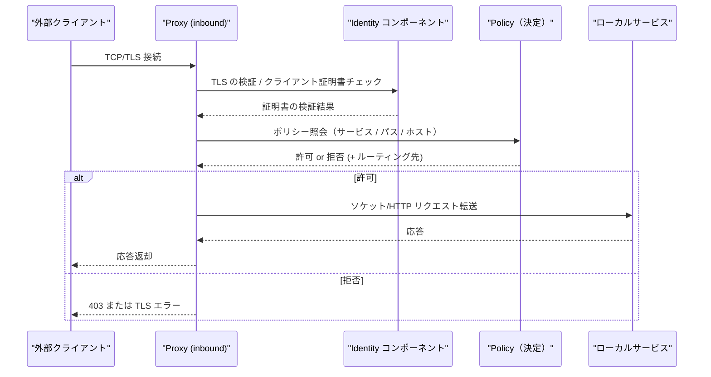
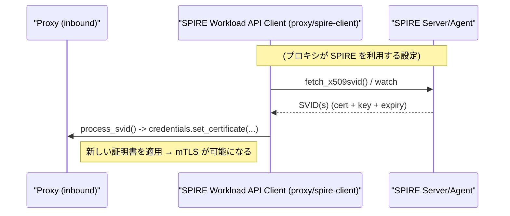
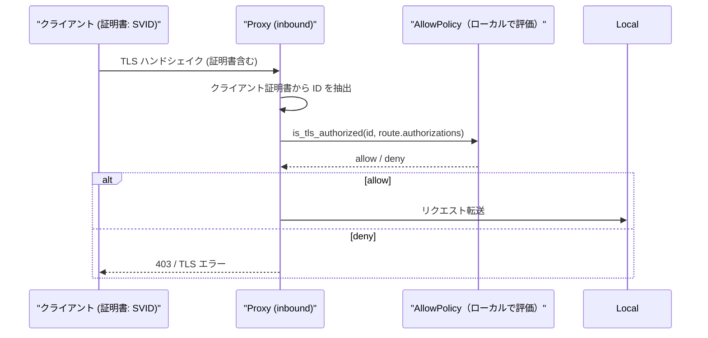
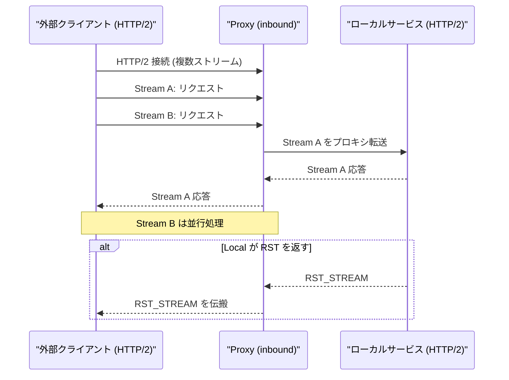
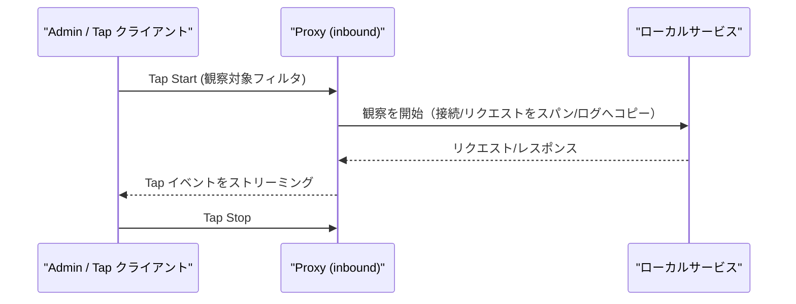

# linkerd2-proxy: Inbound Flow Details

- [linkerd2-proxy: Inbound Flow Details](#linkerd2-proxy-inbound-flow-details)
  - [Overview](#overview)
  - [Representative Sequence (Connection Acceptance → Forwarding to Local Service)](#representative-sequence-connection-acceptance--forwarding-to-local-service)
    - [Reference Code](#reference-code)
  - [Policy: Example of Authorization Using SPIFFE (SVID)](#policy-example-of-authorization-using-spiffe-svid)
    - [Flow When Using SPIRE (Simplified Diagram)](#flow-when-using-spire-simplified-diagram)
    - [Authorization Flow on Receive (When SVID is Detected)](#authorization-flow-on-receive-when-svid-is-detected)
  - [Implementation Considerations](#implementation-considerations)
  - [Notes on HTTP/2](#notes-on-http2)
  - [Tap Example (Connection Observation)](#tap-example-connection-observation)
    - [HTTP/2 Protocol Layer Configuration Examples](#http2-protocol-layer-configuration-examples)
    - [CLI Examples Using Tap (grpcurl Example)](#cli-examples-using-tap-grpcurl-example)

## Overview

`inbound` は外部クライアントからの接続を受け取り、ローカルサービスへ転送する経路を担います。主な責務は次の通りです。

- TLS 終端と mTLS の処理（Identity による証明書検証）
- ポリシー適用（リクエスト許可 / 拒否、ホスト名/パスベースのルーティング）
- メトリクスとアクセスログの収集
- Tap / Admin インターフェースとの連携（接続の観察）

`linkerd/app/src/lib.rs` の `Config::build` では、Identity を準備した後に `Inbound::new` を呼び出して Inbound スタックを作成し、最終的に `serve::serve` でリスナを起動します。

参照実装箇所:

- `linkerd/app/src/lib.rs` (`Inbound::new`, inbound.mk, bind/serve 部分)
- `linkerd/inbound/` （具体的なプロトコル処理、HTTP レイヤー、接続ハンドリング）

## Representative Sequence (Connection Acceptance → Forwarding to Local Service)



### Reference Code

- `linkerd/app/src/lib.rs` — `Inbound::new` と `await_identity` の呼び出し
  - https://github.com/linkerd/linkerd2-proxy/blob/main/linkerd/app/src/lib.rs#L214-L239
  - https://github.com/linkerd/linkerd2-proxy/blob/main/linkerd/app/src/lib.rs#L336-L352
- `linkerd/app/inbound/src/lib.rs` — `Inbound` 構築と `new` 実装
  - https://github.com/linkerd/linkerd2-proxy/blob/main/linkerd/app/inbound/src/lib.rs#L60-L120

```rust
// linkerd/app/inbound/src/lib.rs
pub fn new(config: Config, runtime: ProxyRuntime, prom: &mut prom::Registry) -> Self {
    let runtime = Runtime {
        metrics: InboundMetrics::new(runtime.metrics, prom),
        identity: runtime.identity,
        tap: runtime.tap,
    };
    Self { /* ... */ }
}
```

(実装参照: https://github.com/linkerd/linkerd2-proxy/blob/main/linkerd/app/inbound/src/lib.rs#L152-L160)

**注**: TLS が設定されていない場合は、TLS 段階はスキップされます。mTLS が有効な場合、Identity による SVID の検証が必須になります。

## Policy: Example of Authorization Using SPIFFE (SVID)

以下は、ポリシーで SPIFFE ID を使ってアクセスを許可する**概念的な**例です（実際のポリシーはコントロールプレーンAPI/ServiceProfile等で生成されます）。

```yaml
# 概念的なポリシー片（説明用）
authorizations:
  - meta: { name: "allow-from-frontend" }
    networks: ["10.0.0.0/8"]
    authentication:
      TlsAuthenticated:
        identities: ["spiffe://mesh.local/ns/my-ns/sa/frontend"]
        suffixes: []
```

- 実装上は、TLS のクライアント証明書から抽出した ID (`spiffe://…`) を `is_tls_authorized`（`linkerd/app/inbound/src/policy.rs`）が照合します。

### Flow When Using SPIRE (Simplified Diagram)



### Authorization Flow on Receive (When SVID is Detected)



- 参照: `linkerd/proxy/spire-client/src/api.rs::process_svid`（SPIRE からの SVID 処理）および `linkerd/app/inbound/src/policy/http.rs::authorize` / `linkerd/app/inbound/src/policy.rs::is_tls_authorized`（認可判定）。

## Implementation Considerations

- `await_identity`：Proxy は Identity（証明書）が準備されるまで待機し、定期的に待機ログ（15秒ごと）を出力します。これは `linkerd/app/src/lib.rs` の `await_identity` が担当します。

- Tap と Admin：Inbound 側は管理インターフェース (admin) と Tap を通じて接続の観察や制御ができます。Tap は `Config::build` で admin バインドを用いて構築されます。

- メトリクス：Inbound のメトリクスはプロキシ起動時に `registry` に登録され、Prometheus 形式でエクスポートされます。

## Notes on HTTP/2

HTTP/2 は単一接続上で複数ストリームを扱います。Proxy の観点では次の点に注意が必要です。

- ストリーム・リセット（RST_STREAM）や接続リセットの取り扱い
- フロー制御とウィンドウ管理（バックプレッシャー）
- ストリーム毎のタイムアウトとリトライの適用範囲（リトライは安全な idempotent な操作に限定される）



## Tap Example (Connection Observation)

Tap はライブトラフィックを観察するための機能です。以下は簡易的な Tap の動作図です。



Tap は性能に影響を与え得るため、管理 API でのフィルタリング（特定の対象のみ観察）と短時間での利用が推奨されます。

### HTTP/2 Protocol Layer Configuration Examples

Linkerd プロキシは HTTP/2 のフロー制御設定を環境変数で調整できます。主な設定項目:

- `LINKERD2_PROXY_HTTP2_INITIAL_STREAM_WINDOW_SIZE` — ストリームごとの初期ウィンドウ（デフォルト: 65535）
- `LINKERD2_PROXY_HTTP2_INITIAL_CONNECTION_WINDOW_SIZE` — コネクション全体の初期ウィンドウ（デフォルト: 1048576）

例:

```bash
export LINKERD2_PROXY_HTTP2_INITIAL_STREAM_WINDOW_SIZE=65535
export LINKERD2_PROXY_HTTP2_INITIAL_CONNECTION_WINDOW_SIZE=1048576
```

実装参照: `linkerd/app/src/env/http2.rs` （フロー制御とデフォルト値の定義）
- https://github.com/linkerd/linkerd2-proxy/blob/main/linkerd/app/src/env/http2.rs#L41-L62

> 注意: HTTP/2 の「優先度（priority）」はプロトコルレベルの概念で、アプリ／クライアントがヘッダで指定します。現在のプロキシは主にフロー制御（ウィンドウ管理）とストリームの取り扱いを重視しており、明示的な優先度再書き換えを行う実装は限定的です（実装は将来変わる可能性があります）。

### CLI Examples Using Tap (grpcurl Example)

Tap は gRPC ストリーミング API を通じて観察イベントを返します。Tap サーバの `observe` メソッドは `limit` と `match` を受け取ります（実装参照: `linkerd/proxy/tap/src/grpc/server.rs#L110-L132`）。

簡単な実行例（`TAP_ADDR` を `app.tap_addr()` のホスト:ポートに置き換えてください）:

```bash
# 例: grpcurl を使って Tap を開始する
grpcurl -plaintext -d '{"limit": 10, "r#match": {"http": {"method": "GET", "path": "^/api"}}}' TAP_ADDR linkerd.proxy.tap.Tap/Observe
```

サンプル（簡略化）イベント出力（JSON 風）:

```json
{
  "http": {
    "request_init": {"method": "GET", "path": "/api/1"},
    "response_init": {"status": 200},
    "response_end": {"bytes": 512}
  }
}
```

実際のフィールドはプロトバッファ定義に依存します。詳しい実装は:

- `linkerd/proxy/tap/src/grpc/server.rs` — `observe` の実装
  - https://github.com/linkerd/linkerd2-proxy/blob/main/linkerd/proxy/tap/src/grpc/server.rs#L110-L132
- `linkerd/proxy/tap` の Protobuf 定義（`linkerd2-proxy-api` crate）を参照して、抽出項目 (`Extract`) や `Match` の指定方法を確認してください。

Tap は便利ですが高頻度かつ広域に使うと性能に影響するため、フィルタ条件を厳しくして短時間で利用するのが推奨です。
