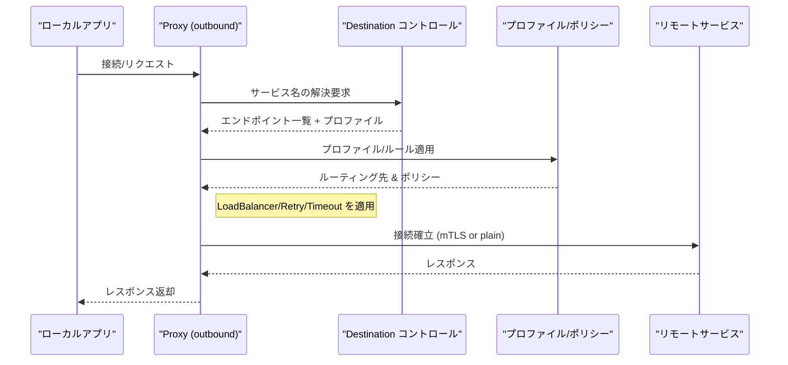
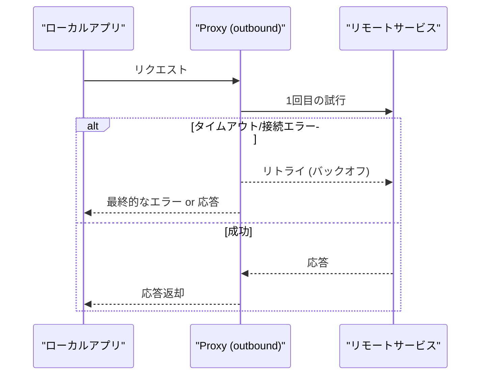
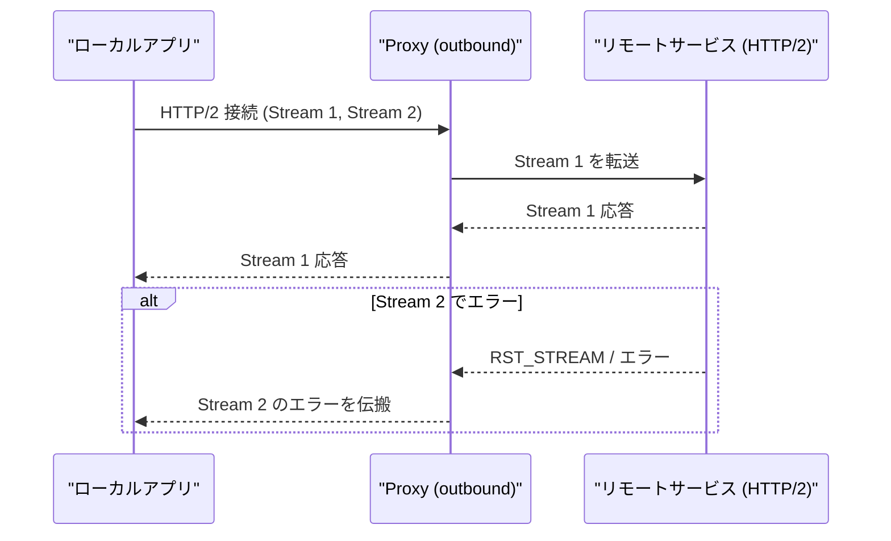
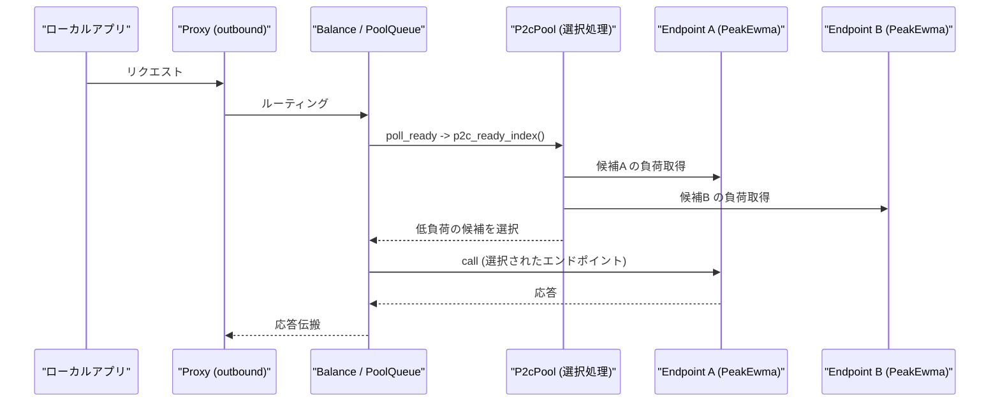
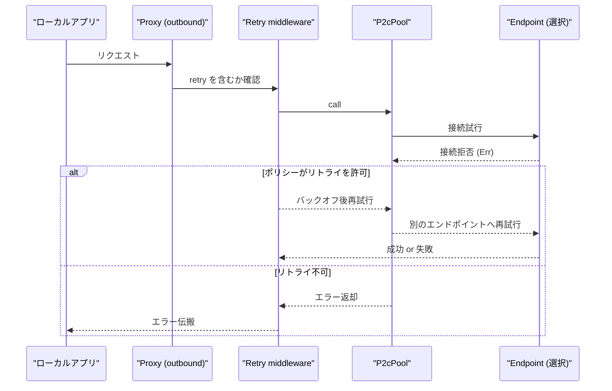
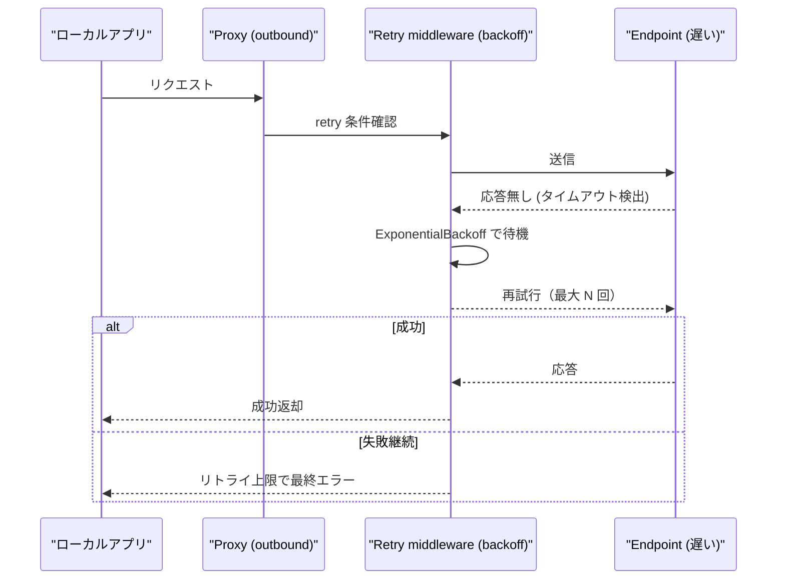
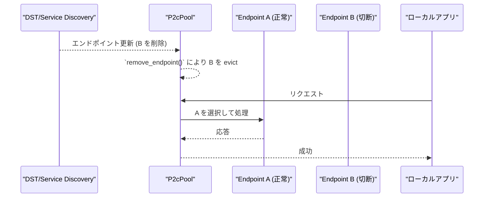

# linkerd2-proxy: Outbound Flow Details

- [linkerd2-proxy: Outbound Flow Details](#linkerd2-proxy-outbound-flow-details)
  - [Overview](#overview)
  - [Representative Sequence (Local -\> Remote)](#representative-sequence-local---remote)
    - [Reference Code](#reference-code)
  - [Implementation Considerations](#implementation-considerations)
  - [Retry / Backoff Behavior](#retry--backoff-behavior)
  - [HTTP/2 Streaming and Partial Failures](#http2-streaming-and-partial-failures)
  - [LoadBalancer (p2c) Implementation Details](#loadbalancer-p2c-implementation-details)
  - [Behavior per Error Scenario (Sequence)](#behavior-per-error-scenario-sequence)
    - [1) Connection refused](#1-connection-refused)
    - [2) Timeout (Failure Due to Delay)](#2-timeout-failure-due-to-delay)
    - [3) Partial partition (some endpoints disconnected)](#3-partial-partition-some-endpoints-disconnected)

## Overview

`outbound` はローカルアプリケーションからのリクエストを受け取り、制御プレーン（Destination, Profiles）やポリシーに基づいてリモートサービスへルーティングします。主な責務は以下の通りです。

- サービス名の解決とエンドポイント取得（DST/Control）
- プロファイルに基づくルーティングとロードバランシング
- リトライ、タイムアウト、サーキットブレイカーなどの耐障害処理
- リモートとの TLS（mTLS）接続確立（Identity を利用）

`linkerd/app/src/lib.rs` の `Config::build` では `Outbound::new` を用いて Outbound スタックを生成し、`serve::serve` で outbound リスナを起動します。

参照実装箇所:

- `linkerd/app/src/lib.rs`（`Outbound::new`, outbound.mk, bind/serve）
- `linkerd/outbound/`（実際のルーティング・フェイルオーバーのロジック）
- `linkerd/dst/`（Destination 解決）

## Representative Sequence (Local -> Remote)



### Reference Code

- `linkerd/app/src/lib.rs` — `Outbound::new` 呼び出し箇所
  - https://github.com/linkerd/linkerd2-proxy/blob/main/linkerd/app/src/lib.rs#L224-L233
- `linkerd/app/outbound/src/lib.rs` — `Outbound::new` と `build_policies` 実装
  - https://github.com/linkerd/linkerd2-proxy/blob/main/linkerd/app/outbound/src/lib.rs#L38-L62
- `linkerd/app/src/dst.rs` — `Config::build`（Destination 解決の実装）
  - https://github.com/linkerd/linkerd2-proxy/blob/main/linkerd/app/src/dst.rs#L1-L80

```rust
// linkerd/app/outbound/src/lib.rs
pub fn new(config: Config, runtime: ProxyRuntime, prom: &mut prom::Registry) -> Self {
    let runtime = Runtime { /* metrics, identity, tap, ... */ };
    Self { config, runtime, stack: svc::stack(()) }
}
```

(実装参照: https://github.com/linkerd/linkerd2-proxy/blob/main/linkerd/app/outbound/src/lib.rs#L125-L133)

```rust
// linkerd/app/src/dst.rs
pub fn build(
    self,
    dns: dns::Resolver,
    legacy_metrics: metrics::ControlHttp,
    control_metrics: control::Metrics,
    identity: identity::NewClient,
) -> Result<Dst<...>, Error> {
    let addr = self.control.addr.clone();
    // ...
}
```

(実装参照: https://github.com/linkerd/linkerd2-proxy/blob/main/linkerd/app/src/dst.rs#L37-L52)

**注**: DST が返すプロファイルにより、リトライやヘルスチェック等の動作が変わります。

## Implementation Considerations

- **DST とプロファイル**: `dst` クライアントはコントロールプレーンと通信し、サービスのエンドポイントと `ServiceProfile` を取得します。これがルーティングと retry/timeout 設定の根拠になります。

- **耐障害機構**: リトライ、タイムアウト、バックオフは `linkerd/outbound` や `linkerd/http` のレイヤで実装されており、Profile によって細かく制御されます。

- **mTLS と Identity**: リモート接続に mTLS を使用する場合、Identity により適切なクライアント証明書が提供されます。

## Retry / Backoff Behavior

Outbound は ServiceProfile に基づきリトライ動作を決定します。一般的な流れは以下の通りです。

- リクエスト失敗時にリトライを適用（ステータス / エラー種別で条件分岐）
- 緩和されたバックオフ（指数バックオフ）を適用
- idempotent でないリクエストにはリトライを避ける制御が必要



## HTTP/2 Streaming and Partial Failures

gRPC や HTTP/2 ストリーミングにおいては、ストリーム単位での失敗やストリームの中断があり得ます。Proxy はストリーム継続か切断かを判断し、必要であればクライアントに適切なエラーを返します。



## LoadBalancer (p2c) Implementation Details

**概要**

- Linkerd のデフォルト Balancer は **Power‑of‑Two‑Choices (p2c)** を採用します。
- 実装は `linkerd/pool/p2c::P2cPool` と、`linkerd/proxy/balance::NewBalance` における `P2cPool::new` の組合せです。
- エンドポイントの負荷指標は `tower::load::PeakEwma` で計測され、p2c はランダムに選んだ 2 つの候補の負荷を比較して軽い方を選びます。

**アルゴリズムの要点**

- エンドポイントは `ReadyCache` により「pending/ready/failed」の状態に管理されます。
- p2c のコアは `p2c_ready_index()` で、候補2つをランダムに選び `ready_index_load()` で負荷を比較します。
- Balancer は `poll_ready()` → `call()` のシーケンスで動作し、`poll_ready()` が選択済みのインデックスを保持して `call()` で実際の呼び出しを行います。



**参考実装**

- `linkerd/pool/p2c/src/lib.rs` — `P2cPool` 実装
  - p2c の生成・選択ロジック: https://github.com/linkerd/linkerd2-proxy/blob/main/linkerd/pool/p2c/src/lib.rs#L1-L40
  - `p2c_ready_index()` と `gen_pair()` の比較ロジック: https://github.com/linkerd/linkerd2-proxy/blob/main/linkerd/pool/p2c/src/lib.rs#L70-L120
  - `poll_ready()` / `call()` の挙動: https://github.com/linkerd/linkerd2-proxy/blob/main/linkerd/pool/p2c/src/lib.rs#L170-L220

- `linkerd/proxy/balance/src/lib.rs` — Balancer の組立
  - `NewBalance::new_service()` が `P2cPool::new` を呼ぶ箇所: https://github.com/linkerd/linkerd2-proxy/blob/main/linkerd/proxy/balance/src/lib.rs#L62-L100
  - `PeakEwma` による負荷計測ラップ: https://github.com/linkerd/linkerd2-proxy/blob/main/linkerd/proxy/balance/src/lib.rs#L100-L140

**ベンチマーク案（未実装）**

現在リポジトリに p2c のベンチは含まれていません。ベンチ結果を追記するための手順案:

1. `linkerd/pool/p2c` にベンチ用の crate を追加（criterion 推奨）。
2. シナリオ: 1/10/100 エンドポイント、異なる RTT 分布、同時接続数を変えたスループット/レイテンシ測定。
3. ローカルで `cargo bench --manifest-path linkerd/pool/p2c/Cargo.toml` を実行して結果を得る。

もしご希望があれば、ベンチ作成と実行をこちらで代行して結果をレポートに追加します（実行にはローカル環境での実行許可が必要です）。

## Behavior per Error Scenario (Sequence)

以下に代表的な障害ケースと、それに対する Proxy の振る舞いを示します。

### 1) Connection refused



- 補足: 実際の再試行とバックオフは `linkerd/http/retry::send_req_with_retries()` が担当します（ExponentialBackoff を使用）。
  - 参照: https://github.com/linkerd/linkerd2-proxy/blob/main/linkerd/http/retry/src/lib.rs#L240-L340

### 2) Timeout (Failure Due to Delay)



- 補足: ExponentialBackoff は `linkerd_exp_backoff::ExponentialBackoff` を利用しており、`send_req_with_retries` 内で `backoff.next().await` によって待機を行います。

### 3) Partial partition (some endpoints disconnected)



- 補足: エンドポイントの追加/削除は `P2cPool::add_endpoint()` / `remove_endpoint()` / `reset_pool()` により処理され、内部の `ReadyCache` とメトリクスが更新されます。
  - 参照: https://github.com/linkerd/linkerd2-proxy/blob/main/linkerd/pool/p2c/src/lib.rs#L140-L200
