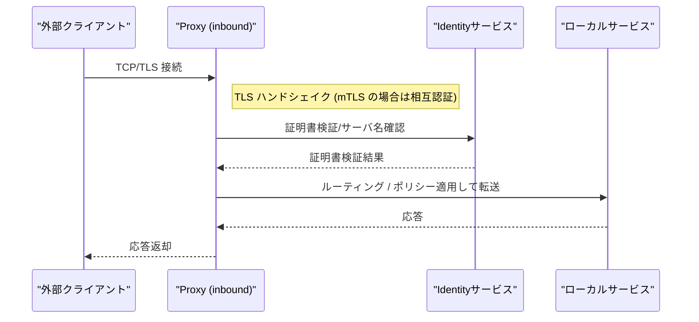
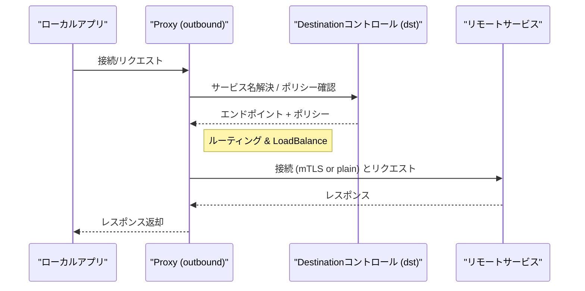
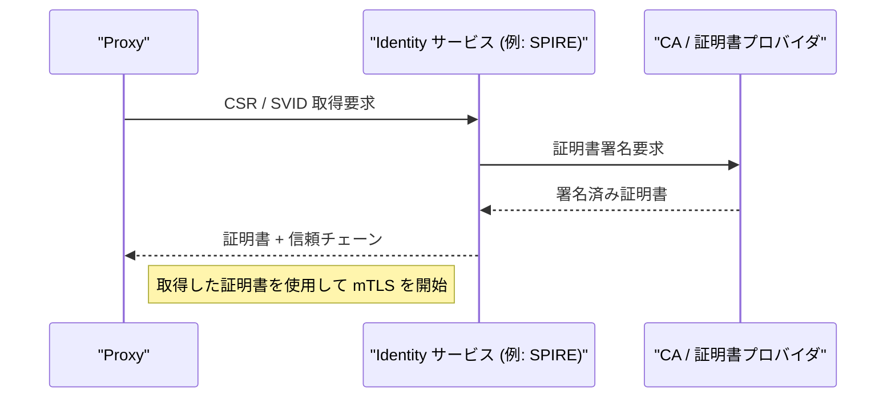

# linkerd2-proxy

- [linkerd2-proxy](#linkerd2-proxy)
  - [Primary Directories and Their Functions](#primary-directories-and-their-functions)
  - [High-Level Processing Flow](#high-level-processing-flow)
  - [Sequence: Inbound (Receive) Flow](#sequence-inbound-receive-flow)
  - [Sequence: Outbound (Send) Flow](#sequence-outbound-send-flow)
  - [Sequence: Identity / Certificate Acquisition Flow](#sequence-identity--certificate-acquisition-flow)
  - [Reference Files (Excerpt)](#reference-files-excerpt)

## Primary Directories and Their Functions

- **`linkerd2-proxy/`** - 実行バイナリ（`src/main.rs`）とランタイムの起点。Proxy のエントリポイント。
- **`linkerd/`** - 多数の内部クレート群（`app`, `identity`, `inbound`, `outbound`, `dst` など）でプロキシのロジックを提供。
  - `linkerd/app` - アプリ全体の `Config` と `App::build` により、Identity、DST（Destination）、ポリシー、Inbound/Outbound スタックを組み立てる。
  - `linkerd/identity` - 証明書取得と mTLS の管理（SPIFFE / SPIRE 連携）。
  - `linkerd/inbound` - 受信パス（外部からの接続をローカルサービスへ転送）。
  - `linkerd/outbound` - 送信パス（ローカルアプリから外部サービスへルーティング）。
- **`spiffe-proto/`** - SPIFFE 関連のプロトバッファ定義など。
- **その他**: `metrics`, `tls`, `dns`, `router`, `policy` など、プロキシの機能ごとに分割。

## High-Level Processing Flow

- 起動 (main.rs)
  - `Config::try_from_env()` で設定を取得
  - `Config::build(...)` で `App` を構築（Identity, DST, Inbound, Outbound, Admin, Tap など）
  - 各リスナ（inbound/outbound/admin）を bind し、`serve` を spawn
- ランタイムは環境変数でコア数を調整（`rt.rs`）
- Identity が初期化されるまでプロキシは待機（`await_identity`）し、定期的に警告を出す

## Sequence: Inbound (Receive) Flow

**ポイント**: Inbound 側は接続を受けてから Identity（ローカルの SVID 層）による検証やポリシー照合を行い、ローカルソケットへ転送します。

## Sequence: Outbound (Send) Flow

**ポイント**: Outbound は DST（制御プレーン）からエンドポイントとプロファイルを受け取り、ポリシーやリトライなどを適用して送信します。

## Sequence: Identity / Certificate Acquisition Flow

**補足**: `linkerd/identity` モジュールがこの役割を持ち、プロキシが起動してリスナを bind する前に有効な証明書を取得／検証します。

## Reference Files (Excerpt)

- `linkerd2-proxy/src/main.rs` — エントリと起動シーケンス
- `linkerd2-proxy/src/rt.rs` — ランタイム構築
- `linkerd/app/src/lib.rs` — `Config::build` と `App` 組立て
- `linkerd/identity` — 証明書 / mTLS まわり
- `linkerd/inbound` / `linkerd/outbound` — 各パスの実装
